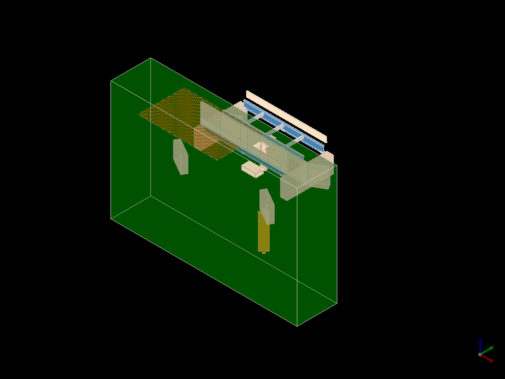
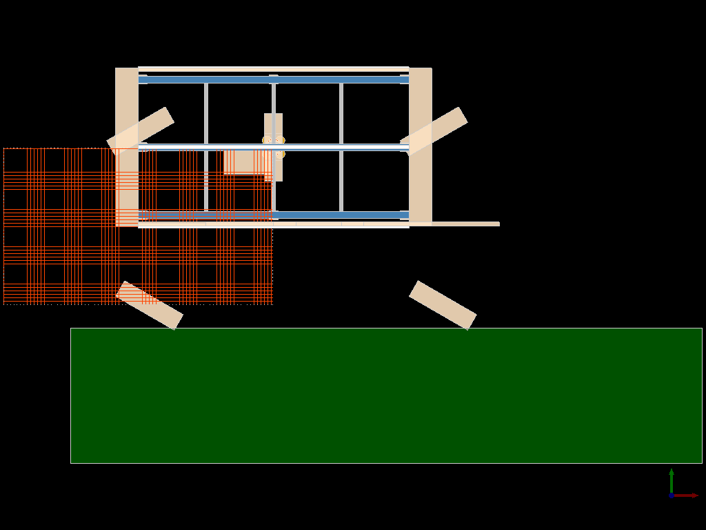
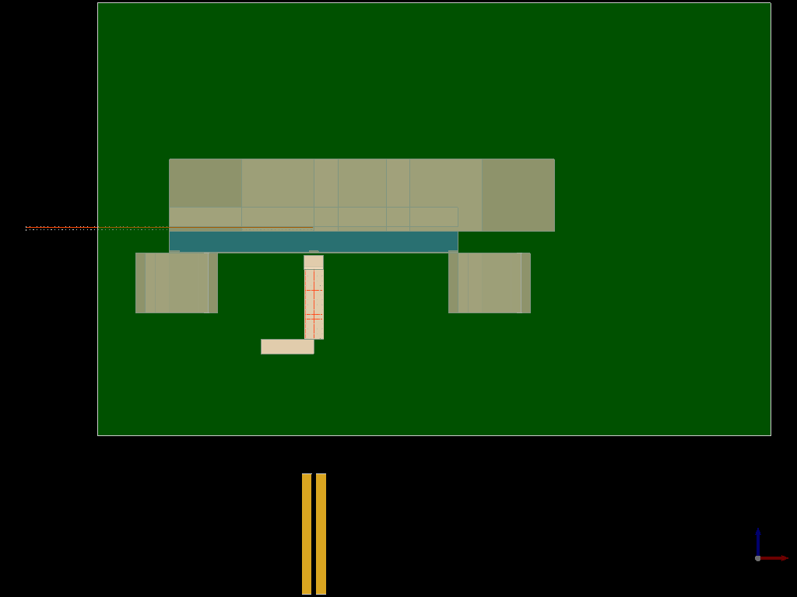

# Osdag Bridge: Parametric 3D CAD Model

FOSSEE Summer Fellowship 2026 Screening Task submission.

### 🖼️ Model Gallery

*Figure 1: Full parametric assembly with valley terrain context.*

*Figure 2: Close-up of elastomeric bearings and tapered pier cap.*

*Figure 3: Plan view of the modular deck and girger alignment.*

*Figure 4: Longitudinal elevation showing pier and pile foundation.*

## 🚀 Overview
- Parametric assembly of steel girder bridges.
- Modular geometry factories.
- Advanced reinforcement logic (deck grids, pier circular cages).
- Standard Quantity Take-Off (BOM) reporting.
- STEP and BREP export.

## How to Run
1. Install `pythonocc-core` (recommend `conda install -c conda-forge pythonocc-core`).
2. Run `python bridge_model.py`.
